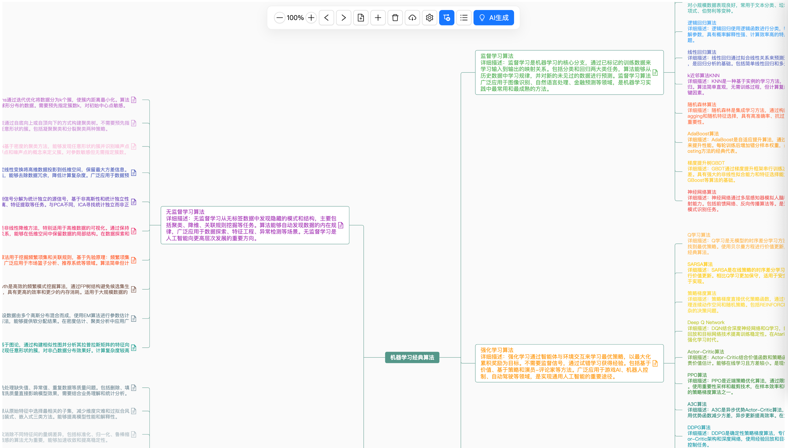
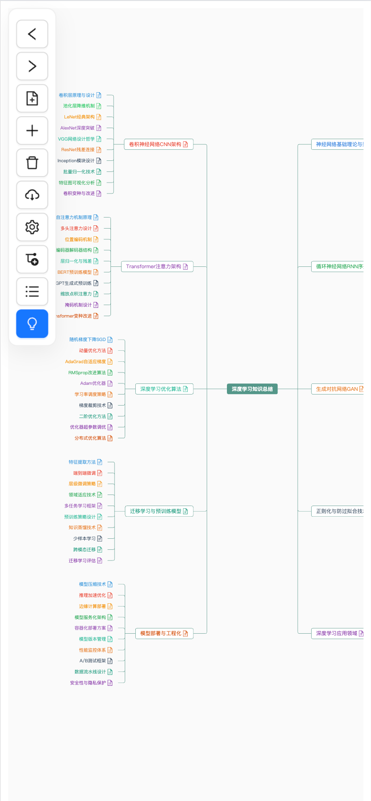

## Project Introduction
This project is a free mind mapping tool that uses AI to think according to summary, induction, first principles, and other thinking methods to generate mind maps.

## Screenshots

### 1. PC



### 2. Mobile


## Project Setup

```sh
yarn
```

### Development Environment

```sh
yarn dev
```

### Production Build

```sh
yarn build
```

### Environment Variables

```
VITE_API= # Your OpenAI API URL, e.g., https://api.openai.com/v1/chat/completions
VITE_SECRET= # Your OpenAI API Secret Key
VITE_MODEL= # Your OpenAI Model, e.g., gpt-5-turbo
```

## Features

### 1. AI Intelligent Generation
- **Thinking Models**: Built-in thinking templates (e.g., First Principles, Critical Thinking), supporting principle viewing and examples.
- **Intelligent Generation**: Automatically generates child nodes based on selected nodes and system prompts. Supports custom API, model (default gpt-5), and generation depth.
- **System Prompts**: Supports uploading .md/.txt/.pdf files to automatically populate the knowledge base, assisting AI generation.
- **Prompt Expansion**: Automatically expands system prompts to optimize AI generation effects.

### 2. Personalization Settings
- **Basic Settings**: API Base, Secret Key, Model Selection, Language Switching (Chinese/English).
- **Theme Customization** (New):
  - **Canvas**: Custom background color.
  - **Lines**: Adjust color, width (1-10px), style (curve/straight/direct).
  - **Font**: Supports switching multiple fonts (e.g., Microsoft YaHei, SimSun, Arial, etc.).
  - **One-click Reset**: Each style supports independent reset to default values.

### 3. Mind Map Operations & Management
- **Layout Switching**: Supports Mind Map, Logical Structure, Fishbone Diagram, and other layouts.
- **Mode Switching**: Supports one-click switching between "Simple Mode" (text only) and "Detailed Mode" (text + notes).
- **Import/Export**: Supports .smm, .json, .xmind, .md, .png, .svg, and other formats.
- **Node Operations**: Supports context menu for add, delete, modify, copy, paste, etc.

### 4. Other Features
- **Persistent Storage**: Automatically saves settings and mind map data locally.
- **Internationalization**: Full support for Simplified Chinese and English interfaces.

## Experience
(1) The JSON output by large models may contain invalid characters and needs to be repaired using `jsonrepair`.
- Import `jsonrepair` library: `yarn add jsonrepair`
- Usage example:
  ```js
  import jsonrepair from 'jsonrepair'
  const repaired = jsonrepair(rawJsonString)
  ```

(2) The `TouchEvent` plugin of `simple-mind-map` intercepts all touch events on mobile devices, causing UI components (such as Ant Design Vue's Select) to become unusable.
- Cause: The official `TouchEvent` plugin binds `touchstart` and other events to `window` without checking if the event target is within the canvas.
- Solution: Copy the official plugin code to the local project (e.g., `src/plugins/TouchEvent.js`) and add a check at the beginning of the event handler:
  ```js
  // If the touch target is not within the mind map container, ignore it to avoid affecting other UI components
  if (!this.mindMap.el.contains(e.target)) {
      return
  }
  ```
- Import the locally modified version when registering the plugin.

## References
(1) https://wanglin2.github.io/mind-map-docs/api/constructor/constructor-methods.html#on-event-fn    
(2) https://ant.design/    
(3) https://medium.com/vincent-chen/  %E8%AE%80%E6%9B%B8%E5%BF%83%E5%BE%97-%E6%80%9D%E8%80%83%E7%9A%84%E6%A1%86%E6%9E%B6-%E4%BA%8C-%E4%B9%9D%E5%A4%A7%E6%80%9D%E7%B6%AD%E6%A8%A1%E5%9E%8B-e6e6d5ad568    
(4) https://www.processon.com/template/mind_free    
(5) https://www.processon.com/knowledge/mindmaptemplate