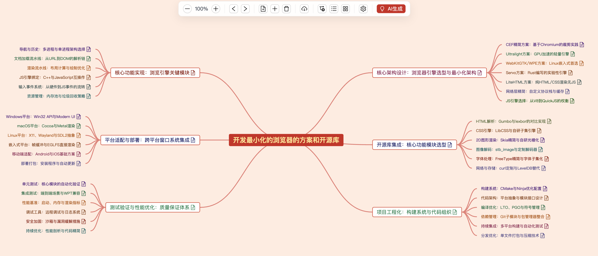
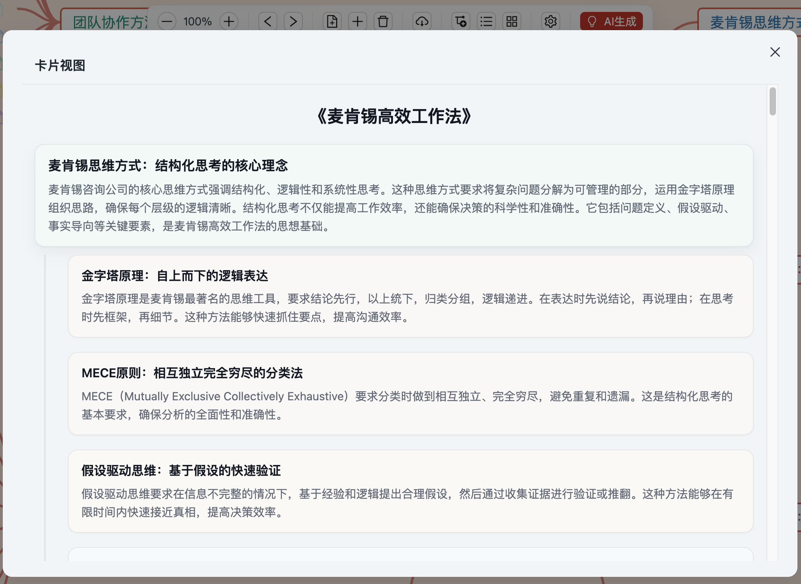

# SimpleMind

English | [中文](./README.md)

A free, in-browser mind mapping tool. Select a node, pick a thinking template, and generate child nodes through an **OpenAI-compatible** Chat Completions API.

- Live demo: https://simple-mind-five.vercel.app
- Repository: https://github.com/linkxzhou/SimpleMind

Stack: Vue 3, Vite 7, Ant Design Vue 4, [simple-mind-map](https://github.com/wanglin2/mind-map).

## Screenshots

### Desktop



### Card view


### Mobile



## Features

### AI generation

- **Thinking templates**: Default (general summary), note-taking, course learning, first principles, Feynman technique, Bayesian thinking, critical thinking, and code generation. Each template has rules and built-in example maps.
- **Generate children**: Select a node and click **AI Generate**. Child nodes are inserted from the node text, current template, and knowledge base (default two-level structure: first level + `children`). “Min nodes per generation” is 1–20 (default 5).
- **Knowledge base**: Enter system context in Settings, or upload `.md` / `.txt` / `.csv` / `.pdf` (parsed to text, truncated at about 20,000 characters).
- **AI expand**: Send the current knowledge base to the model to expand it before generation.
- **Models**: Settings includes `Kimi-K2.5`, `DeepSeek-V3.2`, and `GLM-4.7`. If no env var is set, the default is `Pro/moonshotai/Kimi-K2.5`. Other model IDs can be supplied via environment variables.

### Editing and views

- **Toolbar**: zoom (desktop), undo/redo, new map, add/remove nodes, import/export, detailed/simple mode, thinking templates, card view, settings, AI generate.
- **Layouts**: mind map, logical structure, organization chart, catalog organization, timeline, fishbone.
- **Detailed / simple mode**: detailed mode appends the node note to the text; simple mode keeps the title only.
- **Card view**: renders the map as layered cards; can also be exported as a standalone `card.html`.
- **Node actions**: context menu supports add child, remove current node, remove node with children, copy / cut / paste, mark / unmark.
- **Theme and style**: built-in themes (default `mint`); custom canvas background, line color and width (1–10px), line style (curve / straight / direct), and font (Microsoft YaHei, SimSun, KaiTi, SimHei, LiSu, Arial, and others). Each style can be reset independently.
- **Language**: Simplified Chinese and English. Mouse-wheel zoom and node drag are enabled.

### Import, export, and storage

- **Export**: `.smm`, `.json`, `.svg`, `.png`, `.pdf`, `.md`, `.xmind`, `.txt`, `card.html`.
- **Import**: `.smm`, `.json`, `.xmind`, `.md`. The UI also lists `.xlsx`, but parsing is not implemented.
- **Persistence**: settings and map data are stored in the current tab’s `sessionStorage` and are lost when the tab is closed.

## Requirements

- Node.js `^20.19.0` or `>=22.12.0`
- Yarn (the repo includes `yarn.lock`)

## Setup

```sh
yarn
```

Development:

```sh
yarn dev
```

Production build:

```sh
yarn build
```

Preview the production build:

```sh
yarn preview
```

## Environment variables

Create `.env` or `.env.local` in the project root (`.env.local` is gitignored). These values are only **initial defaults** for the settings panel; they can still be changed in the UI.

The app appends `/chat/completions` to `VITE_API`, so the Base URL must **not** include that path, and should not have a trailing slash.

| Variable | Description | Example |
| --- | --- | --- |
| `VITE_API` | Base URL of an OpenAI-compatible API | `https://api.openai.com/v1` or `https://api.siliconflow.cn/v1` |
| `VITE_SECRET` | API key, sent as `Authorization: Bearer ...` | `sk-xxxxxxxx` |
| `VITE_MODEL` | Default model ID | `Pro/moonshotai/Kimi-K2.5` |

Example:

```
VITE_API=https://api.openai.com/v1
VITE_SECRET=sk-xxxxxxxx
VITE_MODEL=Pro/moonshotai/Kimi-K2.5
```

You can skip env files and fill in API Base, secret, and model in Settings before clicking **AI Generate**. Generation prompts you to configure API Base if it is empty.

## Usage

1. Configure the API via env vars or the settings panel.
2. Select the root node or any node and set its text to the topic you want to expand.
3. Optionally open **Set Thinking Template** to pick a method and load an example, and add material in **Knowledge Base**.
4. Click **AI Generate**. Child nodes are inserted under the selected node.

## Implementation notes

- Model JSON is often invalid; the app already repairs it with [`jsonrepair`](https://www.npmjs.com/package/jsonrepair) before parsing.
- The official `simple-mind-map` `TouchEvent` plugin binds touch handlers on `window` and blocks Ant Design Vue controls on mobile. This repo uses `src/plugins/TouchEvent.js`, which ignores touches whose target is outside the mind-map container.

## References

- [simple-mind-map constructor methods](https://wanglin2.github.io/mind-map-docs/api/constructor/constructor-methods.html#on-event-fn)
- [Ant Design Vue](https://ant.design/)
- [Thinking frameworks: nine models](https://medium.com/vincent-chen/%E8%AE%80%E6%9B%B8%E5%BF%83%E5%BE%97-%E6%80%9D%E8%80%83%E7%9A%84%E6%A1%86%E6%9E%B6-%E4%BA%8C-%E4%B9%9D%E5%A4%A7%E6%80%9D%E7%B6%AD%E6%A8%A1%E5%9E%8B-e6e6d5ad568)
- [ProcessOn mind map templates](https://www.processon.com/template/mind_free)
- [ProcessOn mind map knowledge](https://www.processon.com/knowledge/mindmaptemplate)
